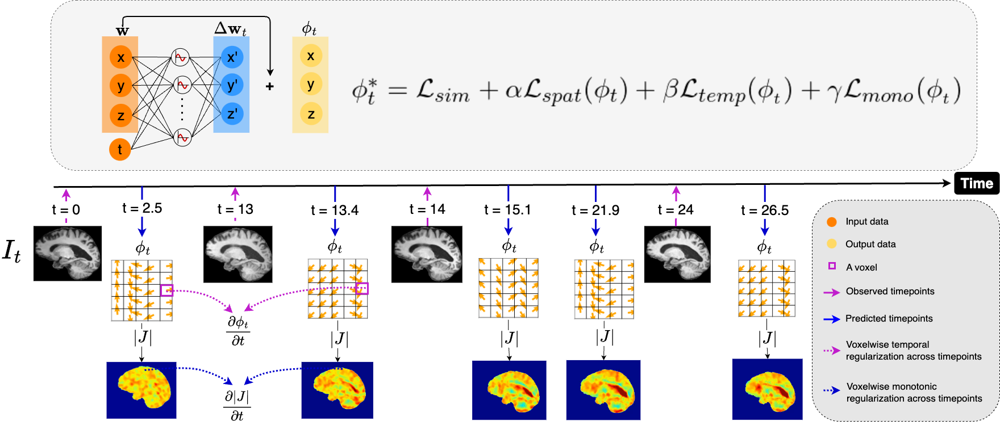

# Capturing Longitudinal Changes in Brain Morphology Using Temporally Parameterized Neural Displacement Fields.

Authors: Aisha Lawal Shuaibu, Kieran A. Gibb, Peter A. Wijeratne, and Ivor J. A. Simpson.

## Summary
Longitudinal image registration enables studying temporal changes in brain morphology which is useful in applications where monitoring the growth or atrophy of specific structures is important. However this task is challenging due to; noise/artifacts in the data and quantifying small anatomical changes between sequential scans. We propose a novel longitudinal registration method that models structural changes using temporally parameterized neural displacement fields. Specifically, we implement an implicit neural representation (INR) using a multi-layer perceptron that serves as a continuous coordinate-based approximation of the deformation field at any time point. In effect, for any $N$ scans of a particular subject, our model takes as input a 3D spatial coordinate location $x, y, z$ and a corresponding temporal representation $t$ and learns to describe the continuous morphology of structures for both observed and unobserved points in time. Furthermore, we leverage the analytic derivatives of the INR to derive a new regularization function that enforces monotonic rate of change in the trajectory of the voxels, which is shown to provide more biologically plausible patterns. We demonstrate the effectiveness of our method on 4D brain MR registration.

## Prerequisites
- `Python`
- `Pytorch`
- `NumPy`
- `NiBabel`

For Visualization:
- `Matplotlib`
- `Seaborn`
- `Neurite`
## 

## Inference
Predicting $|J|$ maps of an AD subject \

## Train your own model

instructions coming soon
#### Contact 
For any questions or potential collaborations contact any of the following people:

Aisha Lawal Shuaibu (corresponding Author): a.shuaibu@sussex.ac.uk

Ivor J. A. Simpson: i.simpson@sussex.ac.uk

